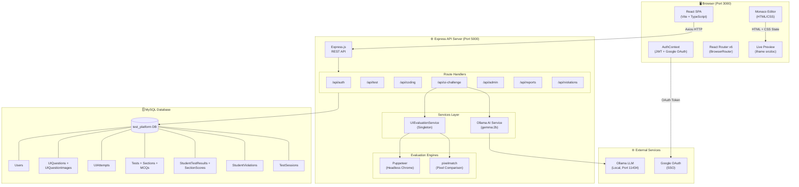
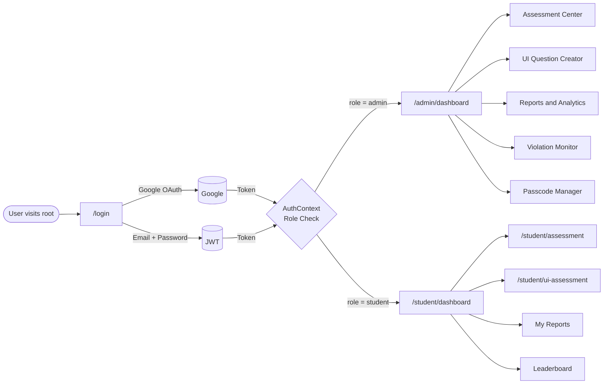
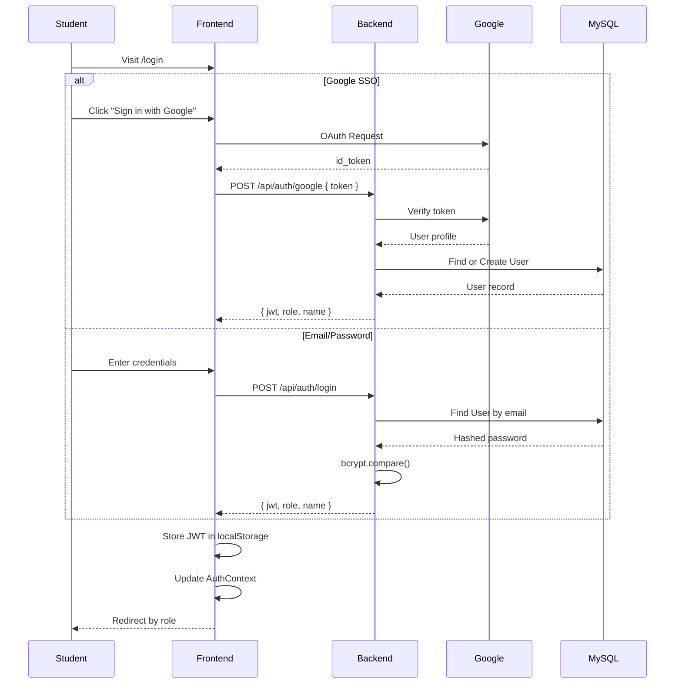
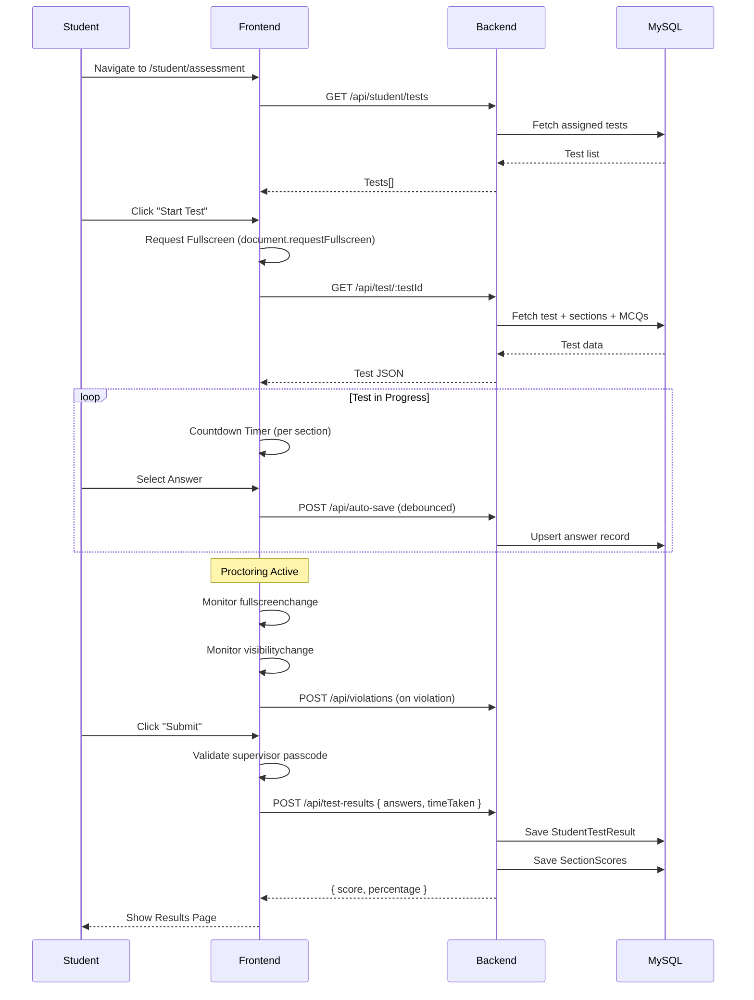
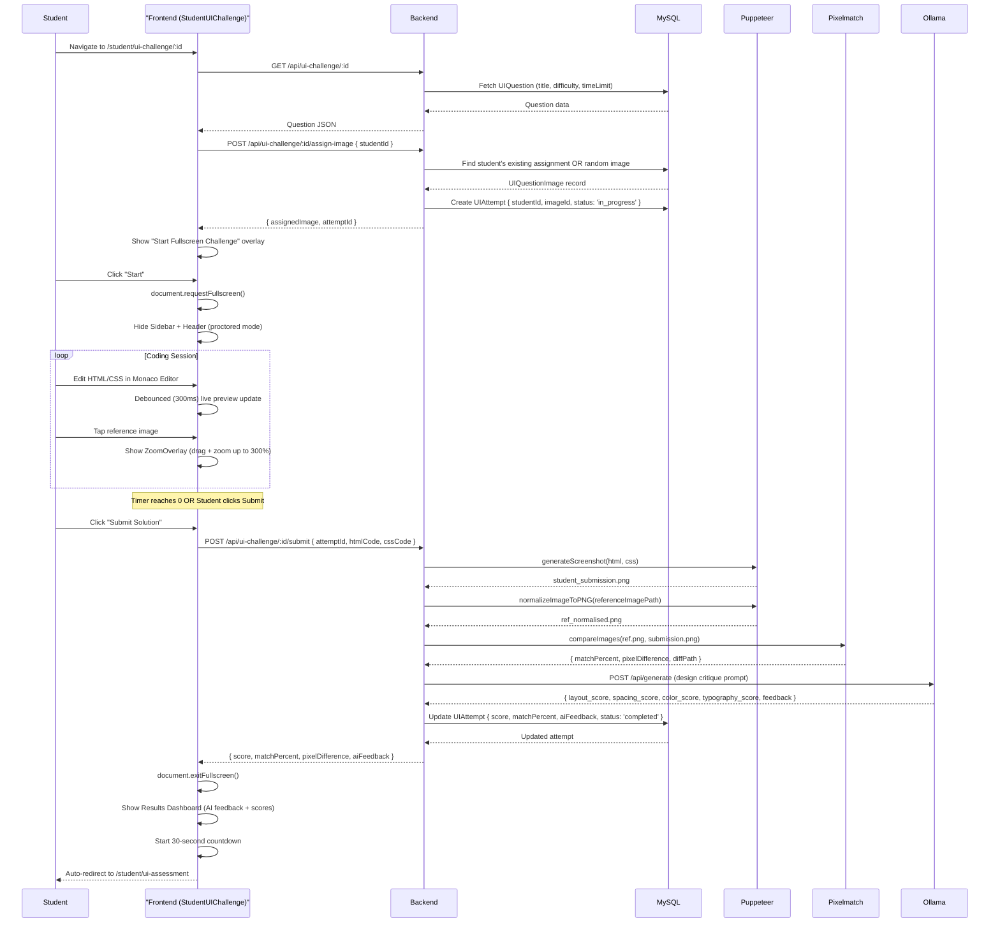
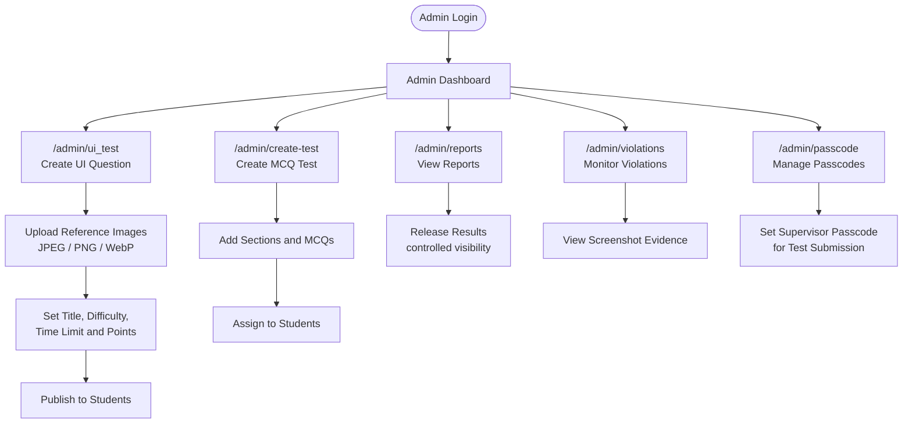
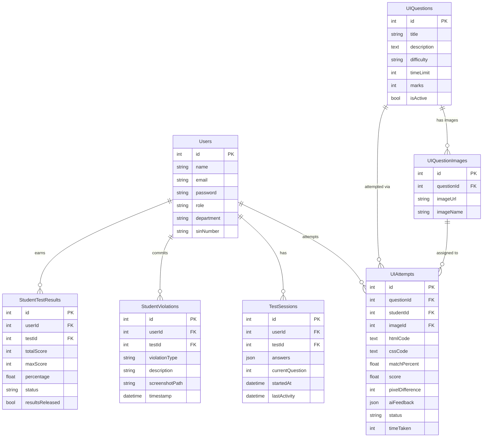
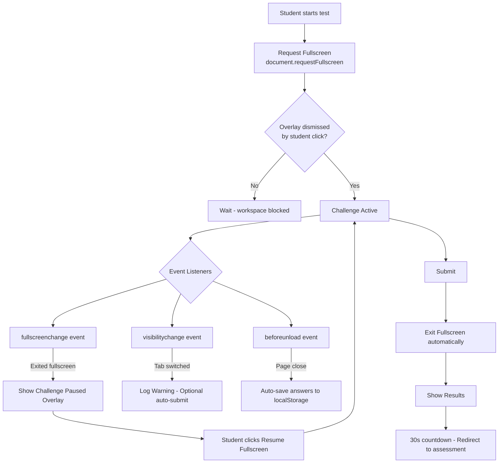

# MCQ Platform — Complete Architecture & Documentation

> A full-stack, AI-powered assessment platform for conducting **MCQ Tests**, **Coding Challenges**, and **UI Cloning Challenges** with real-time proctoring, automated evaluation, and detailed reporting.

---

## Table of Contents

1. [System Overview](#1-system-overview)
2. [Tech Stack](#2-tech-stack)
3. [Repository Structure](#3-repository-structure)
4. [Architecture Diagram](#4-architecture-diagram)
5. [User Roles & Access Flow](#5-user-roles--access-flow)
6. [Feature Flows](#6-feature-flows)
   - [Authentication Flow](#61-authentication-flow)
   - [MCQ Test Flow](#62-mcq-test-flow)
   - [UI Challenge Flow](#63-ui-challenge-flow)
   - [Admin Workflow](#64-admin-workflow)
7. [Database Schema](#7-database-schema)
8. [Backend API Reference](#8-backend-api-reference)
9. [Frontend Routing](#9-frontend-routing)
10. [AI Evaluation Pipeline](#10-ai-evaluation-pipeline)
11. [Proctoring & Security](#11-proctoring--security)
12. [Getting Started](#12-getting-started)

---

## 1. System Overview

The MCQ Platform is a **monorepo** containing two main applications:

| Application | Directory | Port | Purpose |
|---|---|---|---|
| **Frontend** | `mcq_front_next/` | `3000` | Student & Admin React SPA |
| **Backend** | `backend/` | `5000` | Express REST API + AI Evaluation Engine |

**External Dependencies:**
- **MySQL** — Primary relational database (via Sequelize ORM)
- **Ollama (Local LLM)** — `gemma:2b` model for AI design critique
- **Puppeteer** — Headless Chrome for rendering & screenshotting student submissions
- **Google OAuth** — Single-Sign-On for student login

---

## 2. Tech Stack

### Frontend (`mcq_front_next/`)

| Layer | Technology |
|---|---|
| Framework | **React 18** + **TypeScript** |
| Build Tool | **Vite** |
| Routing | **React Router DOM v6** |
| Styling | **Tailwind CSS** + **Glassmorphism** |
| UI Components | **shadcn/ui** + **Radix UI** |
| Animations | **Framer Motion** |
| Icons | **Lucide React** |
| Code Editor | **Monaco Editor** (`@monaco-editor/react`) |
| HTTP Client | **Axios** |
| Auth | **Google OAuth** (`@react-oauth/google`) |
| State | **React Query** + React `useState`/`useContext` |
| Typography | **Outfit** (Google Fonts) |

### Backend (`backend/`)

| Layer | Technology |
|---|---|
| Runtime | **Node.js** |
| Framework | **Express.js** |
| ORM | **Sequelize** (MySQL) |
| Database | **MySQL** (`test_platform` DB) |
| AI Service | **Ollama** (local LLM, `gemma:2b`) |
| Screenshot Engine | **Puppeteer** (headless Chrome) |
| Image Comparison | **pixelmatch** + **pngjs** |
| File Uploads | **Multer** |
| Auth | **JWT** + **bcrypt** |
| Process Management | **dotenv** |

---

## 3. Repository Structure

```
mcq2.o-main/
├── mcq_front_next/          # React + Vite frontend
│   └── src/
│       ├── App.tsx          # Root router
│       ├── index.css        # Global styles (Outfit font, CSS vars)
│       ├── pages/           # Page components (Student + Admin)
│       │   ├── StudentUIChallenge.tsx   # UI Challenge workspace
│       │   ├── MCQTest.tsx              # MCQ test environment
│       │   ├── AdminCreateUIQuestion.tsx
│       │   ├── UiAssessmentCenter.tsx   # Student UI assessment list
│       │   ├── StudentDashboard.tsx
│       │   ├── StudentReports.tsx
│       │   └── ...
│       ├── components/
│       │   ├── StudentLayout.tsx   # Sidebar + Header layout
│       │   └── ui/                 # shadcn/ui primitives
│       ├── contexts/
│       │   └── AuthContext.tsx     # Auth state provider
│       └── utils/
│           └── testResultCleanup.ts
│
└── backend/
    └── src/
        ├── index.js             # Express entry point, route registration
        ├── models/              # Sequelize models
        │   ├── User.js
        │   ├── UIQuestion.js
        │   ├── UIQuestionImage.js
        │   ├── UIAttempt.js
        │   ├── TestSession.js
        │   ├── StudentViolation.js
        │   └── ...
        ├── routes/              # Express routers
        │   ├── uiChallengeRoutes.js
        │   ├── authRoutes.js
        │   ├── testRoutes.js
        │   ├── violationRoutes.js
        │   └── ...
        ├── controllers/         # Business logic
        ├── services/
        │   └── uiEvaluationService.js   # Puppeteer + pixelmatch AI pipeline
        ├── middlewares/         # Auth, error handling
        ├── migrations/          # DB schema migrations
        └── uploads/             # Uploaded reference images
```

---

## 4. Architecture Diagram



---

## 5. User Roles & Access Flow



---

## 6. Feature Flows

### 6.1 Authentication Flow



### 6.2 MCQ Test Flow



### 6.3 UI Challenge Flow



### 6.4 Admin Workflow



---

## 7. Database Schema



---

## 8. Backend API Reference

### Authentication
| Method | Endpoint | Description |
|---|---|---|
| `POST` | `/api/auth/login` | Email/password login |
| `POST` | `/api/auth/google` | Google OAuth login |
| `GET` | `/api/auth/me` | Get current user |

### UI Challenge
| Method | Endpoint | Description |
|---|---|---|
| `GET` | `/api/ui-challenge/:id` | Fetch challenge question |
| `POST` | `/api/ui-challenge/:id/assign-image` | Assign random reference image to student |
| `POST` | `/api/ui-challenge/:id/submit` | Submit HTML/CSS, triggers full evaluation pipeline |
| `GET` | `/api/ui-challenge/:id/results` | Get attempt results |

### MCQ Tests
| Method | Endpoint | Description |
|---|---|---|
| `GET` | `/api/test/:testId` | Fetch test with sections and questions |
| `POST` | `/api/test-results` | Submit final test answers |
| `POST` | `/api/auto-save` | Auto-save in-progress answers |
| `GET` | `/api/student/tests` | List tests assigned to student |

### Violations / Proctoring
| Method | Endpoint | Description |
|---|---|---|
| `POST` | `/api/violations` | Log a proctoring violation event |
| `GET` | `/api/violations/:testId` | Admin: get violations for a test |

### Reports
| Method | Endpoint | Description |
|---|---|---|
| `GET` | `/api/reports/student/:id` | Student performance summary |
| `GET` | `/api/admin/reports` | Admin full reports |
| `GET` | `/api/pdf-report/:testId` | Download PDF report |
| `GET` | `/api/excel-report/:testId` | Download Excel export |

### Result Release (Admin)
| Method | Endpoint | Description |
|---|---|---|
| `PUT` | `/api/admin/results/release/:testId` | Release results to students |
| `PUT` | `/api/admin/results/hide/:testId` | Hide results from students |

---

## 9. Frontend Routing

### Student Routes
| Path | Component | Description |
|---|---|---|
| `/student/dashboard` | `StudentDashboard` | Main student home |
| `/student/assessment` | `StudentAssessment` | MCQ test list |
| `/student/ui-assessment` | `UiAssessmentCenter` | UI challenge list |
| `/student/ui-challenge/:questionId` | `StudentUIChallenge` | **Active workspace (3-panel IDE)** |
| `/student/test/:testId` | `MCQTest` | MCQ test environment (fullscreen) |
| `/student/test/:testId/result` | `TestResult` | Post-MCQ results |
| `/student/reports` | `StudentReports` | Historical results |
| `/student/leaderboard` | `StudentLeaderboard` | Rankings |

### Admin Routes
| Path | Component | Description |
|---|---|---|
| `/admin/dashboard` | `AdminDashboard` | Admin home |
| `/admin/ui_test` | `AdminCreateUIQuestion` | Create UI challenges |
| `/admin/assessment-center` | `AdminAssessmentCenter` | Manage MCQ tests |
| `/admin/reports` | `AdminReports` | Student performance reports |
| `/admin/test-reports` | `AdminTestReports` | Per-test reports |
| `/admin/violations` | `AdminViolations` | Proctoring violations |
| `/admin/passcode` | `AdminPasscode` | Set supervisor passcodes |

---

## 10. AI Evaluation Pipeline

The UI challenge submission triggers a **4-stage automated pipeline**:

```mermaid
flowchart LR
    A["📥 Student Submits<br/>HTML + CSS"] --> B

    subgraph Stage1["Stage 1 — Screenshot"]
        B["Puppeteer<br/>launches headless Chrome"]
        B --> C["Renders student<br/>HTML+CSS at 1200×800"]
        D["📸 Saves submission.png"]
        C --> D
    end

    D --> E

    subgraph Stage2["Stage 2 — Reference Normalize"]
        E["Load teacher's<br/>reference image<br/>(any format)"]
        E --> F["Puppeteer renders<br/>as base64 data-URL"]
        G["📸 Saves ref_normalised.png<br/>(same 1200×800 viewport)"]
        F --> G
    end

    G --> H

    subgraph Stage3["Stage 3 — Pixel Compare"]
        H["pixelmatch compares<br/>2 PNG files<br/>(threshold: 0.1)"]
        H --> I["Counts differing<br/>pixels"]
        I --> J["💯 matchPercent<br/>pixelDifference"]
        I --> K["Saves diff.png<br/>(red highlight)"]
    end

    J --> L

    subgraph Stage4["Stage 4 — AI Critique"]
        L["POST to Ollama<br/>(gemma:2b model)"]
        L --> M["Structured prompt:<br/>rate layout, spacing,<br/>color, typography"]
        M --> N["JSON response:<br/>layout_score,<br/>spacing_score,<br/>color_score,<br/>typography_score,<br/>feedback_text,<br/>priority_fixes[]"]
    end

    N --> O["💾 Save to UIAttempts<br/>in MySQL"]
    O --> P["📊 Send to Student<br/>Results Dashboard"]
```



### Scoring Formula

| Metric | Source | Weight |
|---|---|---|
| **Match Percent** | Pixelmatch (pixel-level) | Primary score |
| **Layout Score** | Ollama LLM (0–100) | AI critique |
| **Spacing Score** | Ollama LLM (0–100) | AI critique |
| **Color Score** | Ollama LLM (0–100) | AI critique |
| **Typography Score** | Ollama LLM (0–100) | AI critique |
| **Final Score** | `matchPercent / 10` → `/maxMarks` | Stored in DB |

---

## 11. Proctoring & Security

The platform implements multi-layer proctoring for both MCQ and UI challenges:



**Key Proctoring Features:**
- 🔒 **Mandatory Fullscreen** — Challenge cannot start without entering fullscreen
- 🔒 **Fullscreen Enforcement** — If student exits, workspace is immediately paused
- 🔒 **Tab Switch Detection** — `visibilitychange` API monitors focus loss  
- 🔒 **Sidebar/Header Hidden** — During fullscreen, navigation is removed from DOM
- 🔒 **Supervisor Passcode** — MCQ test submission requires admin approval
- 🔒 **Violation Logging** — All proctoring events stored in `StudentViolations` table

---

## 12. Getting Started

### Prerequisites

```bash
# Required
node >= 18.x
npm >= 9.x
MySQL >= 8.0

# For AI evaluation (optional)
ollama  # https://ollama.com/
ollama pull gemma:2b
```

### Environment Setup

**Backend** — Create `backend/.env`:
```env
PORT=5000
DB_HOST=localhost
DB_USER=root
DB_PASSWORD=your_password
DB_NAME=test_platform
JWT_SECRET=your_jwt_secret
```

**Frontend** — Create `mcq_front_next/.env`:
```env
VITE_API_URL=http://localhost:5000
NEXT_PUBLIC_GOOGLE_CLIENT_ID=your_google_client_id
```

### Database Setup

```bash
# Create the database
mysql -u root -p -e "CREATE DATABASE test_platform;"

# Run migrations (from backend/)
cd backend
node src/scripts/migrate.js
```

### Running the Application

```bash
# Terminal 1 — Start Backend
cd backend
npm install
npm run dev
# Server starts at http://localhost:5000

# Terminal 2 — Start Frontend
cd mcq_front_next
npm install
npm run dev
# App starts at http://localhost:3000
```

### Quick Start Script

```bash
# From root (Windows)
start-dev.bat
```

### Health Check

```bash
curl http://localhost:5000/api/health
# Expected: {"status":"API is working","database":"connected"}
```

---

## Key Design Decisions

| Decision | Rationale |
|---|---|
| **Puppeteer for screenshots** | Ensures 100% faithful rendering of HTML/CSS — browser engine guarantees layout accuracy |
| **Pixelmatch for comparison** | Pixel-level diff with configurable threshold; format-agnostic after normalization |
| **Local Ollama LLM** | Zero cost, zero latency, no external data sharing — privacy-first AI |
| **Framer Motion** | Declarative animations that degrade gracefully without JS |
| **Monaco Editor** | Industry-standard editor (VS Code engine) with syntax highlighting and IntelliSense |
| **Fullscreen enforcement** | Browser security requires a deliberate user gesture; overlay pattern satisfies this |
| **Singleton UIEvaluationService** | Reuses Puppeteer browser instance to avoid costly startup per submission |
| **30s post-result redirect** | Gives students time to read feedback without leaving navigation control to them |

---

*Platform built with ❤️ — Student UI Premium v2.0*